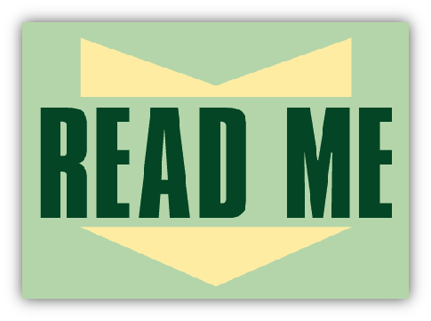

#Seudocódigo

                          Comparación

Escribe una función llamada areArraysSame que tome dos arrays como argumentos. Debe devolver verdadero si los dos arrays son iguales (es decir, tienen los mismos números, en el mismo orden) y false si son diferentes.

1. Crear una funcion que reciba 2 arreglos como parametro
2. Comprobar si la longitud de los arreglos es diferente
  2.1 Si los arreglos no son iguales regresar falso.
  2.2 Si tienen la misma longitud continuar el proceso
3. Comprobar uno a uno los valores del arreglo
  3.1 Si no son iguales regresar false
  3.2. Si no son iguales sigue comparando uno a uno
4. Regresar un true
5. Fin :)

